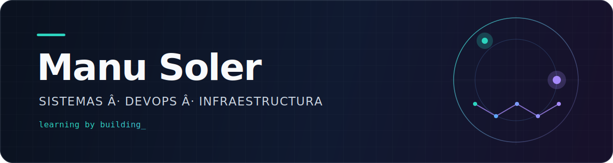

  

 

  <strong>Técnico de Sistemas · ASIR</strong> 
  Linux, virtualización, contenedores y automatización llevados a proyectos reales.

Este perfil es mi cuaderno de trabajo público: aquí convierto lo aprendido en **infraestructuras y servicios que se pueden desplegar, comprobar y repetir**.

Me interesa entender qué ocurre debajo de cada servicio, automatizar lo repetible y documentar tanto las decisiones como los problemas encontrados. Un sistema que solo funciona una vez es un sistema incompleto.

## Proyectos destacados

<table>
  <tr>
    <td width="50%" valign="top">
      <h3>Infraestructura multinodo</h3>
      
Laboratorio de hosting sobre Kubernetes: alta disponibilidad, red privada, almacenamiento persistente y despliegue automatizado.

      
<code>Kubernetes</code> <code>Ansible</code> <code>Kubespray</code> <code>Tailscale</code> <code>Longhorn</code>

      <a href="https://github.com/manusolmel/pim_infra_multinodo"><strong>Explorar el repositorio →</strong></a>
    </td>
    <td width="50%" valign="top">
      <h3>ServicePulse</h3>
      
Portal self-hosted de operaciones para catalogar servicios, monitorizar su estado, gestionar incidencias y preparar despliegues controlados. Actualmente en fase de diseño y especificación.

      
<code>Python</code> <code>FastAPI</code> <code>PostgreSQL</code> <code>Docker</code> <code>GitHub Actions</code>

      <a href="https://github.com/manusolmel/servicepulse"><strong>Explorar el repositorio →</strong></a>
    </td>
  </tr>
  <tr>
    <td colspan="2" valign="top">
      <h3>FastAPI + Vue</h3>
      
Aplicación multicontenedor con frontend, API, base de datos y proxy inverso, preparada para Docker Compose y Kubernetes.

      
<code>FastAPI</code> <code>Vue</code> <code>PostgreSQL</code> <code>Nginx</code> <code>Docker</code>

      <a href="https://github.com/manusolmel/docker-fastapi-vue"><strong>Explorar el repositorio →</strong></a>
    </td>
  </tr>
</table>

 

  

